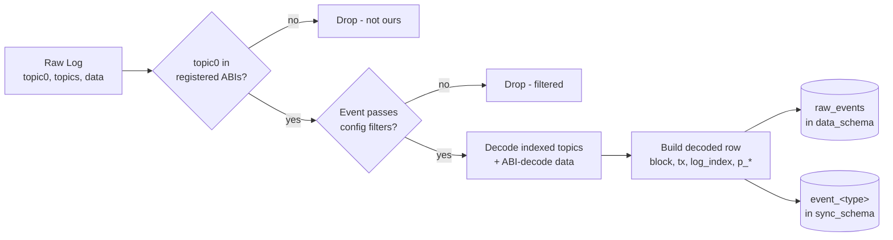
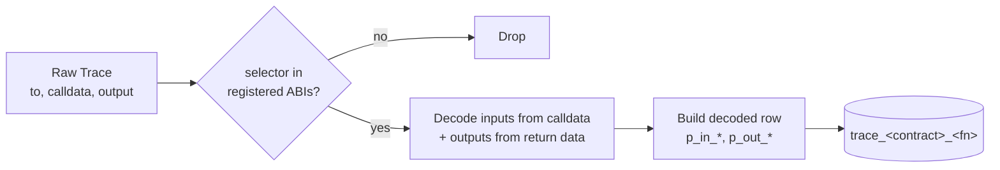

# ABI decoding

Every contract listed in `contracts:` points at an ABI JSON file. At startup the indexer loads all ABIs into a single `AbiDecoder` that:

1. Indexes events by topic0 (keccak256 of the event signature) and functions by 4-byte selector.
2. Generates a Postgres table per event type with one column per indexed parameter (`p_<name>`).
3. At runtime, dispatches each raw log / trace to its decoder and writes rows into the right table.

## Decode flow for a single log



## Table generation

For an event:

```solidity
event Swap(
    address indexed sender,
    uint256 amount0In,
    uint256 amount1In,
    uint256 amount0Out,
    uint256 amount1Out,
    address indexed to
);
```

`AbiDecoder::generate_event_table_sql` produces:

```sql
CREATE TABLE IF NOT EXISTS sync_schema.event_uniswap_v2_pair_swap (
    id            BIGSERIAL PRIMARY KEY,
    block_number  BIGINT  NOT NULL,
    block_hash    TEXT    NOT NULL,
    timestamp     BIGINT  NOT NULL,
    tx_hash       TEXT    NOT NULL,
    tx_index      INTEGER NOT NULL,
    log_index     INTEGER NOT NULL,
    address       TEXT    NOT NULL,
    -- decoded parameters, one column each:
    p_sender      TEXT    NOT NULL,
    p_amount0_in  TEXT    NOT NULL,   -- uint256 → hex-encoded TEXT
    p_amount1_in  TEXT    NOT NULL,
    p_amount0_out TEXT    NOT NULL,
    p_amount1_out TEXT    NOT NULL,
    p_to          TEXT    NOT NULL
);
```

Rules:

- Table name: `event_<contract_name_snake>_<event_name_snake>`.
- Parameter columns: `p_<param_name_snake>`.
- `uint*`, `int*` → `TEXT` (hex-encoded) so every width fits without loss. Cast to `numeric` in SQL when aggregating.
- `address`, `bytes*`, `string` → `TEXT`.
- `bool` → `BOOLEAN`.
- Dynamic arrays / tuples → serialized to JSON `TEXT`.

## Function / trace decoding

The same logic applies to traces, dispatched by the 4-byte selector instead of topic0.



Trace tables carry `p_in_<param>` columns for inputs and `p_out_<param>` columns for outputs. See [traces.md](./traces.md) for how traces are collected.

## Raw events as the source of truth

All events also land in `data_schema.raw_events` in their pre-decode form (topic0-3, data, block/tx coordinates). This is the escape hatch:

- ABI changed? `--rebuild-decoded` re-projects from `raw_events` without touching RPC.
- New deployment with a different `sync_schema`? Same — rebuild from `raw_events`.
- Need to query something the decoder didn't surface? It's all there, decodable with any library.

## Edge cases the decoder handles

- **Events with the same signature across contracts** — each contract's events get their own table, keyed by contract name.
- **Anonymous events** (no topic0) — supported via ABI metadata, matched by data layout.
- **Bytes / strings exceeding type bounds** — gracefully rejected and logged rather than crashing.
- **Unknown topics from an address we're watching** — dropped silently (this is normal for proxy contracts).

## Relevant source

- Event decoder + table generator: [src/abi/decoder.rs](../src/abi/decoder.rs)
- Function/trace decoder: [src/abi/function_decoder.rs](../src/abi/function_decoder.rs)
- Decoded row writer: [src/db/decoded.rs](../src/db/decoded.rs)
- Raw event writer: [src/db/events.rs](../src/db/events.rs)
