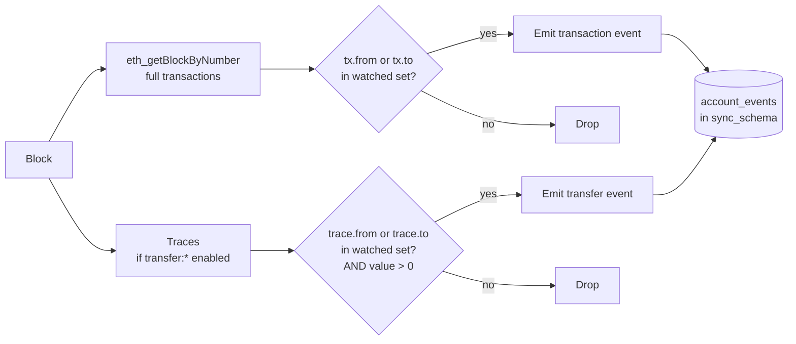

# Accounts / transaction tracking

For specific addresses (treasuries, hot wallets, a protocol's deployer, a user list), the indexer can store every inbound/outbound transaction and every internal ETH transfer — not just decoded events. This gives you a complete activity ledger for those addresses without scanning the whole chain.

## Config

```yaml
accounts:
  enabled: true
  addresses:
    - name: "Treasury"
      address: "0xdead000000000000000000000000000000000001"
      start_block: 10000835
      events:
        - "transaction:from"     # txs originating from this address
        - "transaction:to"       # txs with this address as recipient
        - "transfer:from"        # internal ETH leaving this address
        - "transfer:to"          # internal ETH arriving here
    - name: "HotWallet"
      address: "0x1234567890abcdef1234567890abcdef12345678"
      events: ["transaction:from", "transaction:to"]
```

`transfer:*` events are derived from call traces, so if you use them you **must** also enable [traces.md](./traces.md). `transaction:*` works with plain RPC.

## Flow



## Table shape

One unified `account_events` table — easy to query as a timeline per address:

```sql
SELECT block_number, tx_hash, event_type, value, other_party
FROM sync_schema.account_events
WHERE address = '0xdead...0001'
ORDER BY block_number DESC, log_index DESC
LIMIT 100;
```

Columns include: `address`, `event_type` (one of `transaction:from`, `transaction:to`, `transfer:from`, `transfer:to`), `tx_hash`, `block_number`, `block_timestamp`, `value`, `other_party` (the counterparty), `gas_used`, `status`.

## Static vs dynamic address lists

Today the address list is static — defined in config. If you need dynamic tracking (e.g. "every address that has ever interacted with a protocol"), derive that list from events and run a separate downstream process. Baking it into the indexer is deliberately out of scope: it would couple ingest to application logic.

## Metrics

- `kyomei_account_events_indexed_total{chain_id, event_type}` — one counter per event type (`transaction:from`, etc.).

## Relevant source

- Account syncer: [src/sync/account_syncer.rs](../src/sync/account_syncer.rs)
- Transaction source: [src/sources/transactions.rs](../src/sources/transactions.rs)
- DB writer: [src/db/accounts.rs](../src/db/accounts.rs)
