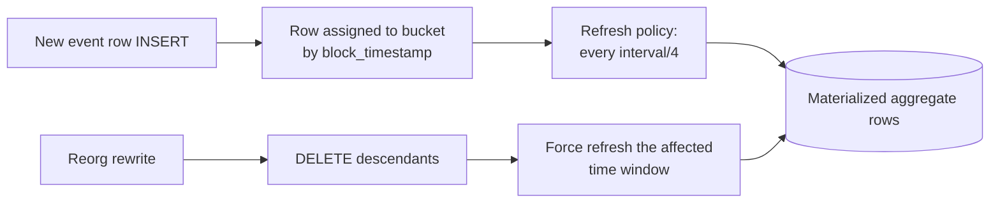

# Continuous aggregates

For any decoded event table, the indexer can install a set of TimescaleDB **continuous aggregates** — auto-refreshing materialized views bucketed by time. This gives you hourly/daily rollups (swap volumes, transfer counts, unique addresses) without writing a single line of application code.

Requires TimescaleDB. Plain Postgres ignores this section.

## Config

```yaml
aggregations:
  enabled: true
  intervals: ["1h", "1d"]                 # supported: 15m 30m 1h 4h 1d 1w
  custom:
    - table: "event_uniswap_v2_pair_swap"
      metrics:
        - name: "total_amount0_in"
          expr: "SUM(p_amount0_in::numeric)"
        - name: "unique_senders"
          expr: "COUNT(DISTINCT p_sender)"
        - name: "max_amount0_in"
          expr: "MAX(p_amount0_in::numeric)"
    - table: "event_erc20_transfer"
      metrics:
        - name: "total_transferred"
          expr: "SUM(p_value::numeric)"
        - name: "unique_senders"
          expr: "COUNT(DISTINCT p_from)"
```

- Every decoded event table automatically gets `event_count` and `tx_count` at every configured interval — you only define `custom` metrics for domain-specific rollups.
- `expr` is raw SQL evaluated inside a `GROUP BY time_bucket`, so anything Postgres/TimescaleDB accepts works: `SUM`, `COUNT`, `AVG`, `MAX`, `MIN`, `COUNT(DISTINCT ...)`, `percentile_cont(...)`, etc.

## Object layout

For every `(table, interval)` pair the indexer creates:

```
<sync_schema>.<table>_agg_<interval>          -- continuous aggregate materialized view
<sync_schema>.<table>_agg_<interval>_policy   -- refresh policy
```

Query them like any view:

```sql
SELECT bucket, total_amount0_in, unique_senders, event_count
FROM uniswap_v2_sync.event_uniswap_v2_pair_swap_agg_1h
WHERE bucket >= NOW() - INTERVAL '7 days'
ORDER BY bucket DESC;
```

## Refresh + reorg semantics



After a reorg rewrite, the indexer explicitly refreshes the aggregate over the window `[block_timestamp(ancestor), now]` so the rollup never lags behind the underlying raw data.

## Default metrics

Even with no `custom` block, every event table gets:

| Metric | Expression |
|---|---|
| `event_count` | `COUNT(*)` |
| `tx_count` | `COUNT(DISTINCT tx_hash)` |

This alone is enough to plot "events per hour" or "unique txs per day" for every indexed event type without extra config.

## Adding aggregates to an existing deployment

Add to config, restart. Migrations are idempotent: existing aggregates are left alone, new ones get created and back-populated. If you need to change a metric expression, the safest path is a new `sync_schema` deployment — TimescaleDB can't ALTER an existing continuous aggregate definition in place.

## Relevant source

- Aggregate SQL generation + migration: [src/db/migrations.rs](../src/db/migrations.rs)
- Config shape: [src/config/mod.rs](../src/config/mod.rs)
