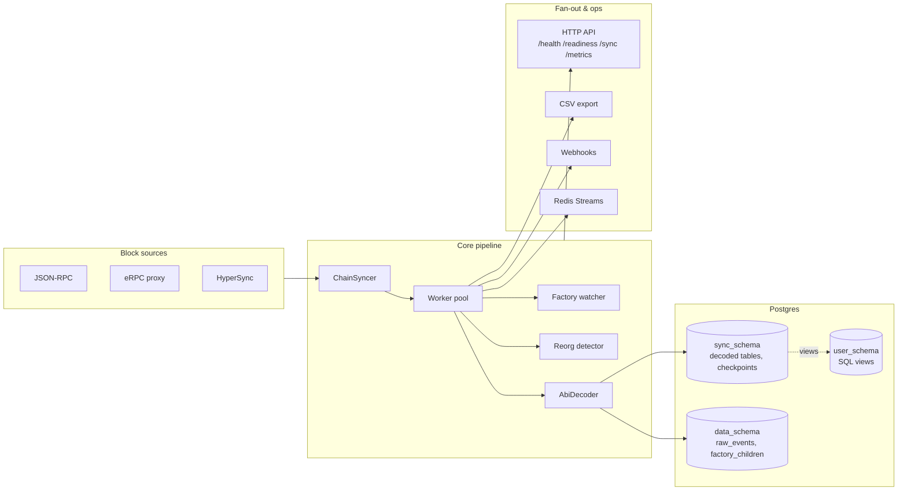
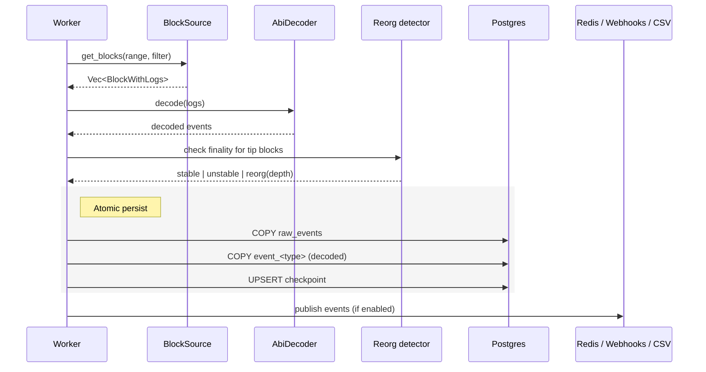
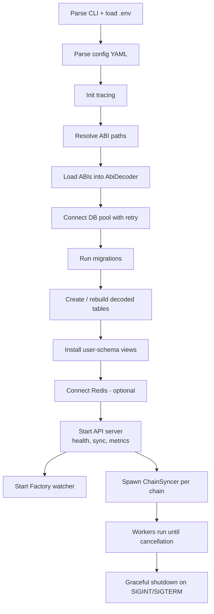

# Architecture

`indexer-evm` is a single Rust binary that pulls blocks from an EVM source, decodes logs (and optionally traces) against user-supplied ABIs, and writes them into Postgres. Everything else — fan-out, views, aggregations, reorg handling — is an optional subsystem around that core loop.

## Components

## Request flow for a single block range

A worker fetches a range, decodes, persists, and fans out. Everything inside the dashed box happens inside one `COPY`-backed transaction so partial writes never land.

## Module map

All code lives under [src/](../src). Each module is self-contained; cross-module contracts are small traits defined in [src/sources/mod.rs](../src/sources/mod.rs) and [src/types.rs](../src/types.rs).

| Module | Responsibility |
|---|---|
| [`main.rs`](../src/main.rs) | CLI entry, config loading, ABI loading, pool/migration/view setup, top-level task wiring. |
| [`config/`](../src/config) | Strongly-typed YAML config, env-var expansion, validation. |
| [`types.rs`](../src/types.rs) | Shared domain types — `BlockRange`, `BlockWithLogs`, `LogFilter`, `BlockWithTraces`. |
| [`sources/`](../src/sources) | Block-source trait + implementations (`rpc`, `erpc`, `hypersync`), plus `fallback`, `concurrency`, `traces`, `transactions`, and adaptive range sizing. |
| [`abi/`](../src/abi) | ABI-driven event decoder and function decoder, SQL schema generation. |
| [`db/`](../src/db) | Postgres pool, migrations, per-concern writers. |
| [`sync/`](../src/sync) | Orchestration: chain syncer, workers, retry, progress, trace + account syncers, view indexer. |
| [`reorg/`](../src/reorg) | Reorg detection and finality tracking. |
| [`factory/`](../src/factory) | Dynamic child-contract discovery (watcher + backfill). |
| [`filter/`](../src/filter) | Predicate evaluation for per-event filters. |
| [`queue/`](../src/queue) | Redis Streams publisher + HTTP webhook publisher. |
| [`export/`](../src/export) | CSV writer. |
| [`api/`](../src/api) | axum server with health, readiness, sync, metrics routes. |
| [`metrics.rs`](../src/metrics.rs) | Prometheus counters/gauges/histograms. |

## Startup sequence

What [`main.rs`](../src/main.rs) does, in order:

### Relevant source

- Top-level wiring: [src/main.rs](../src/main.rs)
- Config parsing: [src/config/mod.rs](../src/config/mod.rs)
- Pool + retry: [src/db/mod.rs:61-113](../src/db/mod.rs#L61-L113)
- Sync orchestration: [src/sync/chain_syncer.rs](../src/sync/chain_syncer.rs)
