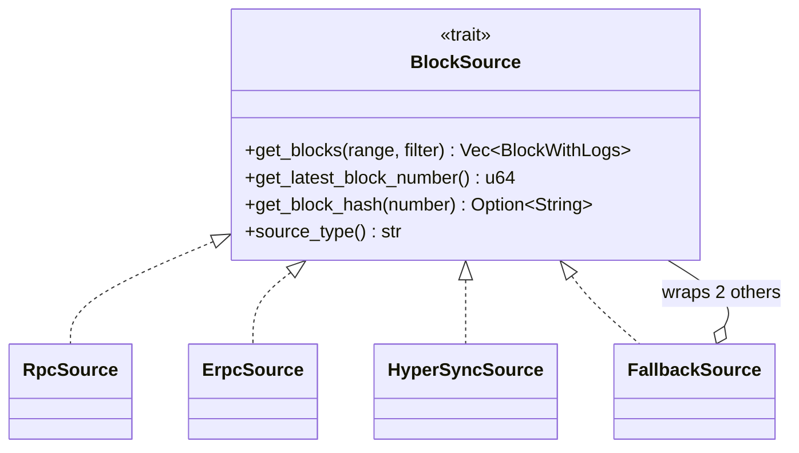
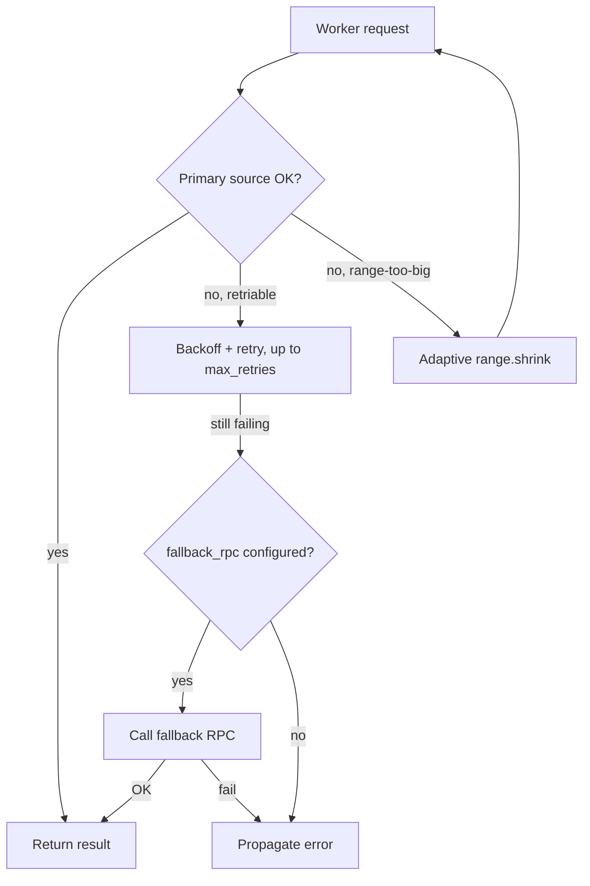

# Block sources

The indexer talks to the chain through a `BlockSource` trait ([src/sources/mod.rs:54-72](../src/sources/mod.rs#L54-L72)). Three implementations ship in-tree and are swappable via one `source.type` key in the config.



## Choosing a source

| Type | When to use | File |
|---|---|---|
| `rpc` | Any EVM chain with a standard JSON-RPC endpoint. Default choice. | [src/sources/rpc.rs](../src/sources/rpc.rs) |
| `erpc` | You run an [eRPC](https://github.com/erpc/erpc) cache/proxy in front of multiple providers. | [src/sources/erpc.rs](../src/sources/erpc.rs) |
| `hypersync` | You need much faster historical backfill (10-100x on supported chains). | [src/sources/hypersync.rs](../src/sources/hypersync.rs) |

`fallback_rpc` is a separate URL on any of the above — used for calls the primary source can't serve (traces, block hashes, `eth_call`) and as a backup when the primary errors.

## Adaptive block range

Every source call goes through an `AdaptiveRange` ([src/sources/mod.rs:9-52](../src/sources/mod.rs#L9-L52)). It shrinks on failure and grows on success so the indexer self-tunes to whatever window size the provider accepts today.

```mermaid
stateDiagram-v2
    [*] --> Default: initial = blocks_per_request

    Default --> Shrunk: error (range too big, payload too large)
    Default --> Grown: 20 consecutive successes
    Shrunk --> Shrunk: still erroring → halve again (min 10)
    Shrunk --> Default: success → +5%
    Grown --> Default: hit max → clamp
    Grown --> Shrunk: error → halve

    note right of Shrunk
      Also: if the RPC error
      embeds an explicit size hint,
      jump straight to that value.
    end note
```

- Min range: 10 blocks.
- Max range: the configured `blocks_per_request`.
- State is held in an `AtomicU64` so concurrent workers can't lose updates — `fetch_update` ensures a single atomic shrink/grow per observation.

## Shared RPC concurrency

All workers share a semaphore ([src/sources/concurrency.rs](../src/sources/concurrency.rs)) so the combined request rate across workers stays under the provider's cap.

- Default limit: `parallel_workers * 2`.
- Override with `sync.max_concurrent_requests`.
- Set to `0` to disable the cap (at your own risk).

## Fallback and retries



- Backoff starts at `retry.initial_backoff_ms`, doubles each attempt, clamped at `retry.max_backoff_ms`.
- `retry.validate_logs_bloom: true` catches a specific RPC misbehavior: when `logsBloom` for a block indicates logs exist but `eth_getLogs` returned an empty array, the response is rejected and retried up to `retry.bloom_validation_retries` times.

## HyperSync specifics

- `api_token` is optional but raises rate limits.
- `fallback_rpc` is required for operations HyperSync doesn't cover (trace/view reads). For known chain IDs the indexer auto-resolves a sane fallback; for custom chains, set it explicitly.

## eRPC specifics

- `project_id` maps to your eRPC project's configured provider pool.
- The eRPC proxy handles caching, load balancing, and failover across providers — the indexer sees one upstream.

## Relevant source

- Trait + adaptive range: [src/sources/mod.rs](../src/sources/mod.rs)
- RPC impl + retry: [src/sources/rpc.rs](../src/sources/rpc.rs)
- HyperSync impl: [src/sources/hypersync.rs](../src/sources/hypersync.rs)
- eRPC impl: [src/sources/erpc.rs](../src/sources/erpc.rs)
- Fallback wiring: [src/sources/fallback.rs](../src/sources/fallback.rs)
- Shared semaphore: [src/sources/concurrency.rs](../src/sources/concurrency.rs)
