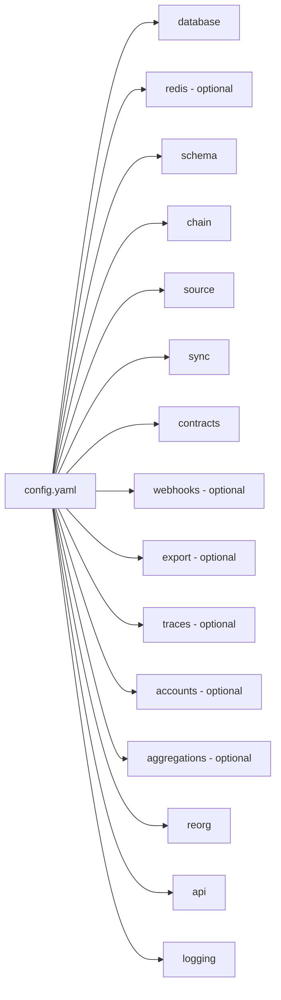

# Configuration

The indexer is configured by a single YAML file passed via `--config`. All paths referenced inside it (ABIs) are resolved relative to the config file's directory, so a config that works in development works identically in Docker when mounted at `/app/config/config.yaml`.

## Precedence

1. CLI flag — `--config path/to/config.yaml` (default: `config.yaml`).
2. Environment variables referenced via `${VAR}` inside the YAML are expanded at load time. `.env` is auto-loaded from the working directory.

## Top-level shape



## Core sections

### `database`
```yaml
database:
  connection_string: "${DATABASE_URL}"
  pool_size: 20
```
TimescaleDB is recommended for aggregations + hypertables, but plain Postgres 14+ works for everything else.

### `schema`
```yaml
schema:
  data_schema: "kyomei_data"       # shared raw_events, factory_children
  sync_schema: "my_app_sync"       # per-deployment decoded tables + worker checkpoints
  user_schema: "my_app"            # stable views — what your app queries
```
See [schema-model.md](./schema-model.md) for why this three-layer split exists.

### `chain` + `source`
```yaml
chain:
  id: 1
  name: "ethereum"

source:
  type: "rpc"                       # rpc | erpc | hypersync
  url: "https://eth.llamarpc.com"
  fallback_rpc: "https://rpc.ankr.com/eth"
```
See [block-sources.md](./block-sources.md) for the differences and when to pick each.

### `sync`
```yaml
sync:
  start_block: 10000835
  parallel_workers: 4
  blocks_per_request: 10000
  blocks_per_worker: 250000
  event_buffer_size: 10000
  checkpoint_interval: 500
  retry:
    max_retries: 5
    initial_backoff_ms: 1000
    max_backoff_ms: 30000
    validate_logs_bloom: true
    bloom_validation_retries: 3
```
See [sync-engine.md](./sync-engine.md) for how these interact.

### `contracts`
```yaml
contracts:
  - name: "UniswapV2Factory"
    address: "0x5C69bEe701ef814a2B6a3EDD4B1652CB9cc5aA6f"
    abi_path: "./abis/UniswapV2Factory.json"
    start_block: 10000835

  - name: "UniswapV2Pair"
    factory:                        # dynamic discovery — see factory-contracts.md
      address: "0x5C69bEe701ef814a2B6a3EDD4B1652CB9cc5aA6f"
      event: "PairCreated"
      parameter: "pair"
    abi_path: "./abis/UniswapV2Pair.json"
    start_block: 10000835
    filters:                        # optional, see filters.md
      - event: "Swap"
        conditions:
          - field: "amount0_in"
            op: "gt"
            value: "0"
    views:                          # optional, see views.md
      - function: "totalSupply"
        interval_blocks: 100
```

## Optional feature sections

Each of these is off by default and documented on its own page:

| Section | Feature | Doc |
|---|---|---|
| `webhooks` | HTTP fan-out of decoded events | [fan-out.md](./fan-out.md) |
| `export.csv` | Per-event-type CSV files | [fan-out.md](./fan-out.md) |
| `traces` | Call trace indexing | [traces.md](./traces.md) |
| `accounts` | Per-address transaction + transfer tracking | [accounts.md](./accounts.md) |
| `aggregations` | TimescaleDB continuous aggregates | [aggregations.md](./aggregations.md) |

## Operational sections

### `reorg`
```yaml
reorg:
  max_reorg_depth: 1000             # unstable-zone window
  # finality_blocks: 65             # override chain-specific default
```

### `api`
```yaml
api:
  host: "0.0.0.0"
  port: 8080
```

### `logging`
```yaml
logging:
  level: "info"                     # trace | debug | info | warn | error
  format: "json"                    # pretty | json
```

## Multi-chain format

Instead of `chain` + `source` + `sync` + `contracts` at the top level, use a `chains:` list. One process, N chains, shared DB/Redis/API. See [multi-chain.md](./multi-chain.md).

## Validation

Config is parsed into strongly-typed structs in [src/config/mod.rs](../src/config/mod.rs); invalid YAML or missing required fields fail fast at startup with a clear error. The bundled [config.example.yaml](../config.example.yaml) exercises every section and is the best hands-on reference.
