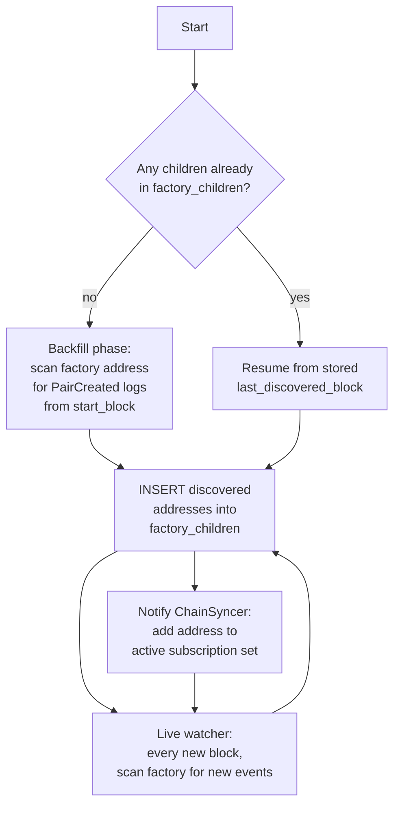

# Factory contracts

Factories emit an event whenever they deploy a new child contract (e.g. Uniswap V2 `PairCreated`, ERC-4626 vault factories, lending-pool factories). The indexer turns that event into a dynamic subscription: once discovered, the child contract is watched for the rest of indexing as if it had been listed in `contracts:` from the start.

## Config

```yaml
contracts:
  - name: "UniswapV2Factory"
    address: "0x5C69bEe701ef814a2B6a3EDD4B1652CB9cc5aA6f"
    abi_path: "./abis/UniswapV2Factory.json"
    start_block: 10000835

  - name: "UniswapV2Pair"                 # child contract template
    factory:
      address: "0x5C69bEe701ef814a2B6a3EDD4B1652CB9cc5aA6f"
      event: "PairCreated"
      parameter: "pair"                   # which event param carries the child address
      # child_contract_name: "UniswapV2Pair"  # optional, defaults to contract name
      # child_abi_path: "./abis/UniswapV2Pair.json"  # optional, uses abi_path if not set
    abi_path: "./abis/UniswapV2Pair.json"
    start_block: 10000835
```

## Discovery flow

Discovery runs in two phases, matching the sync engine: a one-shot backfill and a continuous watcher.



- **Backfill** ([src/factory/backfill.rs](../src/factory/backfill.rs)) — runs once at startup if the factory has never been scanned; uses the same adaptive-range logic as the main sync engine.
- **Watcher** ([src/factory/watcher.rs](../src/factory/watcher.rs)) — piggybacks on the live phase; every block is scanned for factory events and any new children are registered before the next block's subscription filter is built.

## Shared table: `factory_children`

All factory deployments write to one shared table in `data_schema`:

```
factory_children
├── factory_address
├── child_address
├── child_contract_name
├── discovered_block
└── discovered_tx_hash
```

This gives you:

- A single join-anywhere list of every factory-deployed contract.
- Cheap `sync_schema` rebuilds — re-creating decoded tables reuses the existing children rather than re-scanning.
- Observability — `SELECT count(*) FROM kyomei_data.factory_children WHERE factory_address = ...`.

## Subscription recomputation

The live worker keeps an in-memory set of addresses to include in the `LogFilter` it passes to the block source. Whenever the watcher inserts new children, the set is recomputed before the next fetch — within a few blocks of the `PairCreated` event, swaps on the new pair are already being indexed.

## Edge cases the watcher handles

- **Factory event during a reorg** — a child added by a reorged-away block is undone as part of the normal rewrite transaction.
- **Hundreds of new children per block** — the per-worker address batching (`addresses_per_batch`) handles this by splitting a single worker's subscription into parallel per-batch fetches rather than spawning more workers.
- **Multiple factory templates for the same child type** — both are listed in `contracts:`; their children land in the same `factory_children` table but with different `child_contract_name`.

## Relevant source

- Watcher: [src/factory/watcher.rs](../src/factory/watcher.rs)
- Backfill: [src/factory/backfill.rs](../src/factory/backfill.rs)
- DB writer: [src/db/factory.rs](../src/db/factory.rs)
