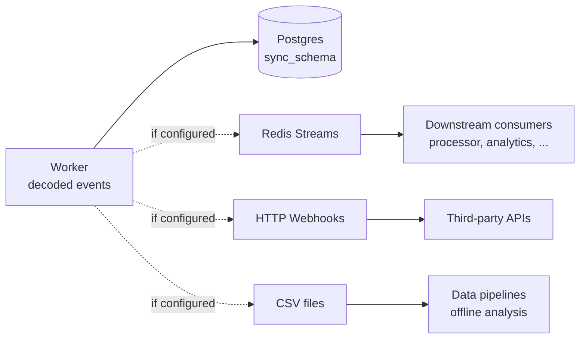
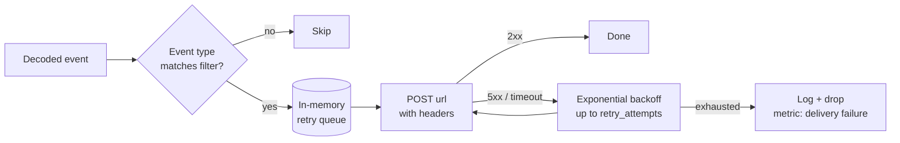

# Fan-out: Redis, Webhooks, CSV

Three optional outputs, all fed from the same decoded-event stream, all additive. You can enable any combination (or none — the indexer is perfectly useful as a Postgres-only store).



Fan-out runs **after** the Postgres write commits — Postgres is authoritative and fan-out is best-effort. A failed webhook or Redis outage never blocks ingestion.

## Redis Streams

### Config
```yaml
redis:
  url: "${REDIS_URL}"
  batch_notification_interval: 1000      # emit batch marker every N blocks during historic
```

### Stream keys

| Key | Contents |
|---|---|
| `kyomei:events:<chain_id>` | One entry per decoded event: `{ event_type, contract, address, block, tx_hash, log_index, params }`. |
| `kyomei:control:<chain_id>` | Lifecycle markers: `historic_started`, `historic_complete`, `live_caught_up`, `reorg_detected`, `batch_checkpoint`. |

### Behaviour

- During **historic backfill** the events stream can be extremely high-throughput. `batch_notification_interval` batches control-stream checkpoints so consumers can advance cursors without being flooded.
- During **live** every event is published individually, in block order.
- Reorg rewrites emit a `reorg_detected` control message with `ancestor` and `depth` — consumers must be idempotent on `(tx_hash, log_index)` to handle this correctly.

### Consumer pattern
```bash
redis-cli XREAD COUNT 100 BLOCK 1000 STREAMS kyomei:events:1 $
```

## HTTP Webhooks

### Config
```yaml
webhooks:
  - url: "https://api.example.com/events"
    events: ["Transfer", "Swap"]           # empty / omitted = all events
    retry_attempts: 3
    timeout_secs: 10
    headers:
      Authorization: "Bearer ${WEBHOOK_TOKEN}"
```

### Delivery flow



- One POST per event; request body is JSON matching the Redis event shape.
- Multiple webhooks can be configured and are fanned out in parallel — one slow endpoint can't block another.
- Failures after `retry_attempts` are logged and dropped; there is no persistent queue. If you need at-least-once delivery into a downstream system, consume Redis Streams instead.

## CSV export

### Config
```yaml
export:
  csv:
    enabled: true
    output_dir: "./data/csv"
```

### Behaviour

- One file per event type: `event_<contract>_<event>.csv`.
- Columns mirror the `event_<type>` table (`block_number, tx_hash, log_index, address, p_*`).
- Appended in block order; files are rotated when they hit a size threshold and named with a block range suffix.
- Useful for feeding a data warehouse (Snowflake, BigQuery) via periodic loads, or for offline analysis without needing Postgres access.

## Ordering and idempotency

All three outputs publish events in the order Postgres committed them — effectively block order, and within a block, log-index order. Consumers should:

- Dedupe on `(tx_hash, log_index)` for events.
- Dedupe on `(tx_hash, trace_address)` for traces.
- Handle reorgs as replays: the same event arriving twice with a different block hash means the first delivery was from a reorged-away block.

## Relevant source

- Redis publisher: [src/queue/publisher.rs](../src/queue/publisher.rs)
- Webhook publisher: [src/queue/webhook.rs](../src/queue/webhook.rs)
- CSV writer: [src/export/csv.rs](../src/export/csv.rs)
