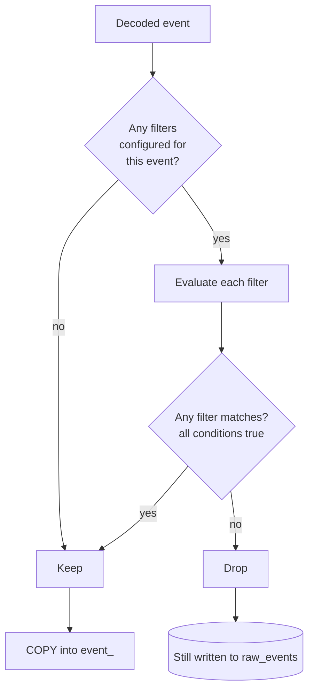

# Filters

Per-event filters let you drop uninteresting events before they hit Postgres. This is useful when a popular contract emits events you genuinely don't care about (zero-value transfers, dust swaps, self-transfers) and you'd rather not pay the storage cost.

Filters run after decoding but before the `COPY` into `event_<type>`. The raw event is still written to `raw_events` — filters only narrow the decoded tables.

## Config

```yaml
contracts:
  - name: "UniswapV2Pair"
    abi_path: "./abis/UniswapV2Pair.json"
    filters:
      - event: "Swap"
        conditions:
          - field: "amount0_in"
            op: "gt"
            value: "0"
      - event: "Transfer"
        conditions:
          - field: "value"
            op: "gte"
            value: "1000000000000000000"   # ≥ 1e18
          - field: "to"
            op: "neq"
            value: "0x0000000000000000000000000000000000000000"
```

All `conditions` inside a single filter are AND-ed. To OR, list the same event twice with different condition sets — an event is kept if it matches **any** listed filter for that event type.

## Supported operators

| Op | Meaning | Works on |
|---|---|---|
| `eq` | Equal | any |
| `neq` | Not equal | any |
| `gt` | Greater than (numeric compare of hex-encoded uint/int) | numeric types |
| `gte` | Greater or equal | numeric |
| `lt` | Less than | numeric |
| `lte` | Less or equal | numeric |
| `contains` | Substring contains | string / bytes |

## Evaluation flow



The raw event always reaches `raw_events` so:

- Filters can be changed later and applied retroactively via `--rebuild-decoded`.
- You never lose data you might want tomorrow.

## Field names

`field` is the parameter name as declared in the ABI, case-sensitive. Indexed and non-indexed parameters both work — filters run on the decoded value, not the topic slot.

## Relevant source

- Predicate evaluation: [src/filter/mod.rs](../src/filter/mod.rs)
- Applied from: [src/sync/chain_syncer.rs](../src/sync/chain_syncer.rs)
