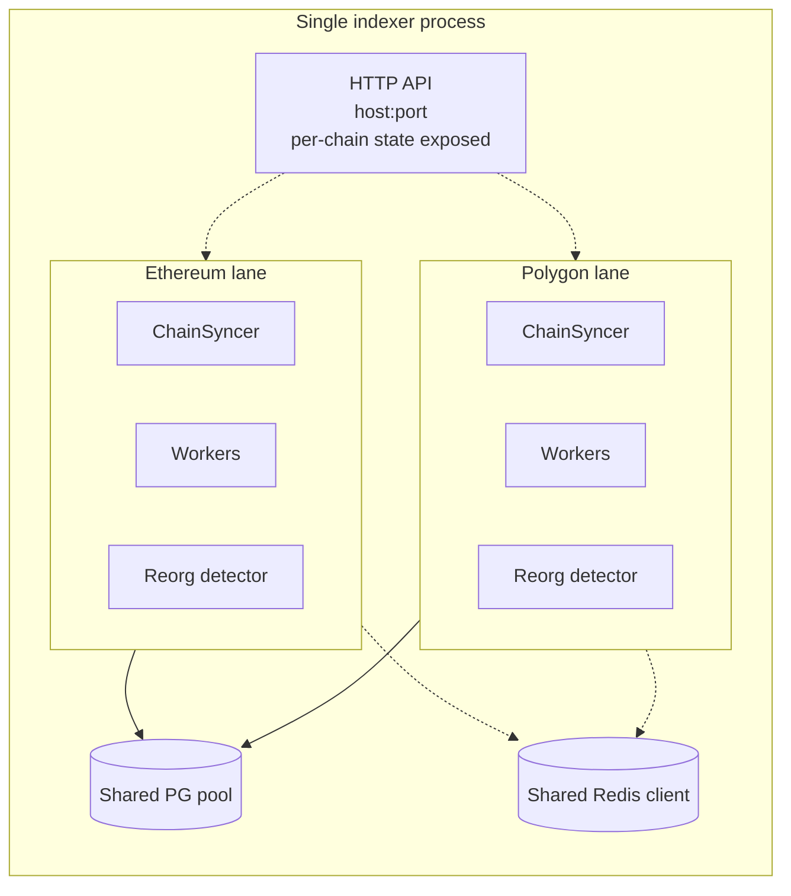

# Multi-chain mode

One process, one binary, N chains. Multi-chain mode shares the database pool, the Redis connection, the metrics registry, and the HTTP API between chains while keeping per-chain sync state fully isolated.

## When to use it

Use multi-chain when you want a single operational surface for several EVM chains of the same application (e.g. same protocol on Ethereum + Polygon + Arbitrum). Don't use it when chains belong to totally different products — the coupling is minor, but a crash in one chain's syncer stops the whole process.

## Config shape

Replace the top-level `chain / source / sync / contracts` keys with a `chains:` list. Shared pieces (`database`, `redis`, `api`, `logging`) stay at the top.

```yaml
database:
  connection_string: "${DATABASE_URL}"
redis:
  url: "${REDIS_URL}"
api:
  host: "0.0.0.0"
  port: 8080
logging:
  level: "info"
  format: "json"

chains:
  - chain: { id: 1, name: "ethereum" }
    schema:
      sync_schema: "eth_sync"
      user_schema: "eth"
    source:
      type: "rpc"
      url: "${ETH_RPC}"
    sync:
      start_block: 18000000
      parallel_workers: 4
    contracts:
      - name: "USDC"
        address: "0xA0b86991c6218b36c1d19D4a2e9Eb0cE3606eB48"
        abi_path: "./abis/ERC20.json"

  - chain: { id: 137, name: "polygon" }
    schema:
      sync_schema: "poly_sync"
      user_schema: "poly"
    source:
      type: "hypersync"
      fallback_rpc: "https://polygon-rpc.com"
    sync:
      start_block: 50000000
    contracts:
      - name: "USDC"
        address: "0x2791Bca1f2de4661ED88A30C99A7a9449Aa84174"
        abi_path: "./abis/ERC20.json"
```

## Isolation model



- Each chain gets its own `sync_schema` and `user_schema`. Collisions are impossible unless you misconfigure.
- `data_schema` is shared across chains; `raw_events` and `factory_children` carry a `chain_id` column.
- Each chain has its own `ChainSyncer`, worker pool, reorg detector, and finality cursor.

## Shared resources

| Resource | Shared how |
|---|---|
| Postgres connection pool | `pool_size` applies across all chains. Budget ~`parallel_workers * num_chains` + headroom. |
| Redis client | All chains publish to their own stream keys (`kyomei:events:<chain_id>`). |
| RPC semaphore | Per-chain, not shared — one chain's provider rate limit doesn't constrain another. |
| API + metrics | One HTTP server exposes per-chain state. Every metric is labeled `chain_id`. |
| Logs | All chains log to the same subscriber; `chain_id` / `chain_name` fields identify the source. |

## API in multi-chain mode

`/sync` returns an array with one entry per configured chain, each showing:

```json
{
  "chain_id": 1,
  "chain_name": "ethereum",
  "current_block": 19234567,
  "tip_block": 19234570,
  "lag_blocks": 3,
  "phase": "live",
  "source_type": "rpc"
}
```

`/health` and `/readiness` are aggregated:
- `/health` → 200 when the shared pool (and Redis, if configured) are reachable.
- `/readiness` → 200 only when **every** chain has caught up to its configured ready threshold.

## Relevant source

- Multi-chain config parsing: [src/config/mod.rs](../src/config/mod.rs)
- Top-level spawn per chain: [src/main.rs](../src/main.rs)
- Per-chain API state: [src/api/mod.rs](../src/api/mod.rs)
