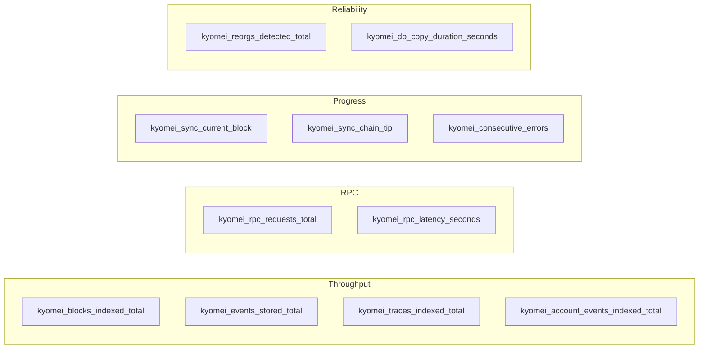

# Observability

The indexer exposes one HTTP port (default `0.0.0.0:8080`) with all probes and the Prometheus scrape endpoint. Logs go to stdout as `tracing` events.

## Endpoints

| Path | Method | Purpose | Status codes |
|---|---|---|---|
| `/health` | GET | Liveness — the process is up and infra is reachable | 200 / 503 |
| `/readiness` | GET | Readiness — initial backfill has caught up | 200 / 503 |
| `/sync` | GET | Per-chain sync progress as JSON | 200 |
| `/metrics` | GET | Prometheus exposition format | 200 |

### `/health` — liveness

200 when:
- Postgres is reachable (`SELECT 1` succeeds).
- Redis is reachable (`PING` succeeds), **or** Redis is not configured.

Response body:
```json
{ "status": "ok", "database": "connected", "redis": "connected" }
```

Use as a Kubernetes `livenessProbe`. If this is red, restart the pod — the pool or Redis handle is broken.

### `/readiness` — readiness

200 only after the historic phase has completed and the indexer is within the live window of the chain tip. Use as a Kubernetes `readinessProbe`. Crucially, this gates the zero-downtime deployment cutover described in [schema-model.md](./schema-model.md).

Response body:
```json
{ "status": "ready", "mode": "live" }
```

### `/sync` — progress

Per-chain view of how far along the indexer is. Returns an array (one entry per configured chain in multi-chain mode):

```json
[
  {
    "chain_id": 1,
    "chain_name": "ethereum",
    "current_block": 19234567,
    "tip_block": 19234570,
    "lag_blocks": 3,
    "phase": "live",
    "source_type": "rpc"
  }
]
```

### `/metrics` — Prometheus

Standard Prometheus text format.

## Metric catalogue

All metrics carry a `chain_id` label. Defined in [src/metrics.rs](../src/metrics.rs).



### Throughput
- `kyomei_blocks_indexed_total{phase=historic|live}` — blocks processed.
- `kyomei_events_stored_total` — decoded events written.
- `kyomei_traces_indexed_total{phase}` — trace rows written.
- `kyomei_account_events_indexed_total{event_type}` — account events written.

### RPC
- `kyomei_rpc_requests_total{status=ok|err}` — RPC call outcomes.
- `kyomei_rpc_latency_seconds` — RPC latency histogram.

### Progress
- `kyomei_sync_current_block` — highest block the indexer has written.
- `kyomei_sync_chain_tip` — highest block the source has reported.
- `kyomei_consecutive_errors` — counter of consecutive failures (reset on success). Alert when this stays non-zero.

### Reliability
- `kyomei_reorgs_detected_total` — total reorgs rewritten.
- `kyomei_db_copy_duration_seconds` — duration histogram of `COPY` batches.

## Useful PromQL

```promql
# Indexing speed (blocks/sec, per chain, smoothed)
rate(kyomei_blocks_indexed_total[5m])

# Sync lag
kyomei_sync_chain_tip - kyomei_sync_current_block

# RPC error rate
sum(rate(kyomei_rpc_requests_total{status="err"}[5m])) by (chain_id)
/
sum(rate(kyomei_rpc_requests_total[5m])) by (chain_id)

# P99 RPC latency
histogram_quantile(0.99, sum by (le, chain_id) (rate(kyomei_rpc_latency_seconds_bucket[5m])))

# Reorg rate (per hour)
rate(kyomei_reorgs_detected_total[1h]) * 3600
```

## Logs

- Subscriber: `tracing-subscriber` with `env-filter` and JSON output.
- Configured via `logging.level` (`trace | debug | info | warn | error`) and `logging.format` (`pretty | json`).
- Every log entry carries `chain_id` / `chain_name` when emitted from a per-chain task.
- Passwords in connection strings are masked before logging — see [src/db/mod.rs:49-59](../src/db/mod.rs#L49-L59).

## Alerting cheat sheet

| Alert | Condition | Why |
|---|---|---|
| Indexer stalled | `kyomei_consecutive_errors > 0` for 5m | Live-phase failures are accumulating; adaptive range may not be rescuing it. |
| Falling behind | `kyomei_sync_chain_tip - kyomei_sync_current_block > 100` for 10m | RPC too slow / provider throttling / workers too few. |
| Reorg storm | `rate(kyomei_reorgs_detected_total[5m]) > 10` | Source is serving an unstable fork or `max_reorg_depth` is too small. |
| DB copy slow | `histogram_quantile(0.99, rate(kyomei_db_copy_duration_seconds_bucket[5m])) > 5` | Postgres under pressure or network latency to DB. |
| RPC errors | RPC error rate > 5% for 5m | Upstream is flaky; fallback RPC should be engaging. |

## Relevant source

- Metric definitions: [src/metrics.rs](../src/metrics.rs)
- Health handler: [src/api/health.rs](../src/api/health.rs)
- Sync handler: [src/api/sync.rs](../src/api/sync.rs)
- API assembly: [src/api/mod.rs](../src/api/mod.rs)
