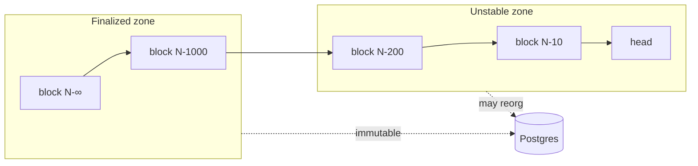
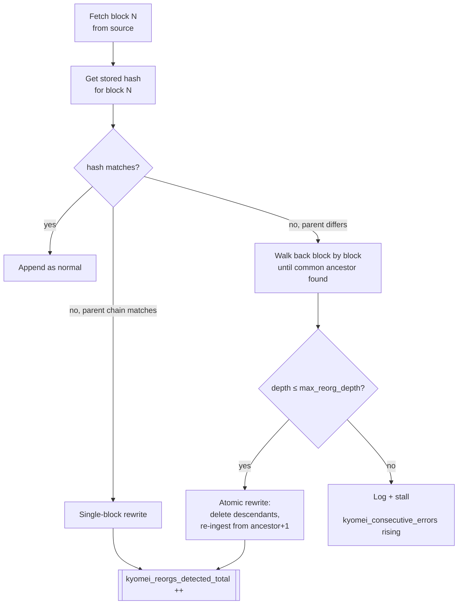

# Reorg handling

The indexer assumes that any block within `max_reorg_depth` of the chain tip is *unstable* and may be rewritten. Blocks older than that are considered *finalized* and never rewritten.

## Conceptual model

- `max_reorg_depth` (default 1000) is the window size.
- `finality_blocks` per chain (derived from chain ID; overridable in `reorg` config) is the depth at which blocks graduate from unstable to finalized.

## Detection

In the live phase, every block we ingest has its hash compared to the hash we stored previously at the same height (via `BlockSource::get_block_hash`).

## The rewrite transaction

Rewriting is done in one transaction so readers never see a partial state:

1. `DELETE FROM raw_events WHERE block_number > ancestor`
2. `DELETE FROM event_<type> WHERE block_number > ancestor` (for every decoded table)
3. `DELETE FROM trace_<type> ... ` (if traces are enabled)
4. `DELETE FROM account_events WHERE block_number > ancestor` (if accounts are enabled)
5. Re-ingest blocks `(ancestor, tip]` from the source with fresh decoded rows.
6. `UPDATE workers SET last_block = tip`.

Aggregate continuous aggregates (TimescaleDB) are auto-refreshed on the affected time window; see [aggregations.md](./aggregations.md).

## Finality

The `finality_watcher` ([src/reorg/finality.rs](../src/reorg/finality.rs)) advances a per-chain finality cursor. Once a block falls below that cursor it's considered stable and:

- Will never be walked during reorg detection.
- May be purged from the unstable-zone cache.
- Contributes to stability of downstream aggregates.

Chain defaults:

| Chain | Default `finality_blocks` |
|---|---|
| Ethereum mainnet | 65 (~2 epochs) |
| Polygon | 256 |
| Arbitrum / Optimism | 1 (soft-finality) |
| Other | 100 (conservative) |

Override with `reorg.finality_blocks` when deploying on a chain not in the built-in list.

## What's surfaced

- **Metric:** `kyomei_reorgs_detected_total{chain_id}` — increment per rewrite.
- **Metric:** `kyomei_consecutive_errors{chain_id}` — rises if reorgs exceed `max_reorg_depth` (catastrophic; usually means `max_reorg_depth` is too small for this chain or the source is serving a different fork).
- **Log:** `reorg detected, depth=N, ancestor=0x..., tip=0x...`.

## Relevant source

- Detector: [src/reorg/detector.rs](../src/reorg/detector.rs)
- Finality tracker: [src/reorg/finality.rs](../src/reorg/finality.rs)
- Rewrite transaction: used from [src/sync/chain_syncer.rs](../src/sync/chain_syncer.rs)
