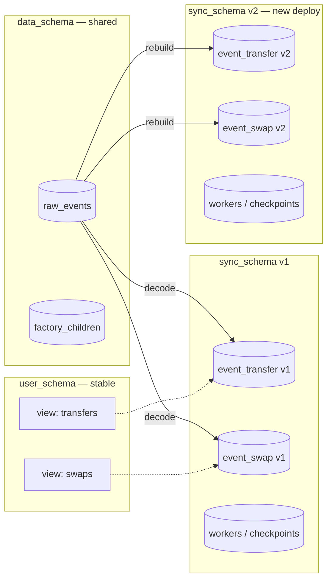

# Schema model

Three logical schemas, one database. The separation is what makes zero-downtime cutovers possible and what decouples the raw data from the decoded shape.

| Schema | Purpose | Owned by |
|---|---|---|
| `data_schema` (default `kyomei_data`) | Raw `raw_events`, factory `factory_children`. The ground truth. | Shared across all deployments. |
| `sync_schema` (e.g. `my_app_sync`) | Decoded per-event tables, trace/account tables, worker checkpoints. | **One per deployment.** |
| `user_schema` (e.g. `my_app`) | Stable SQL views. What your application queries. | Points at the currently-active `sync_schema`. |



## Why three schemas

- **Raw events are expensive to re-fetch.** Keeping them in `data_schema` means ABI changes, a new decoded column, or a brand-new deployment all become cheap: re-project from `raw_events` rather than re-scan RPC.
- **Decoded tables change shape with ABIs.** They belong with the deployment that wrote them.
- **Applications need a stable contract.** Views in `user_schema` give you names that never change even when you reshape `sync_schema`.

## Zero-downtime deployment

```mermaid
sequenceDiagram
    autonumber
    participant Old as Indexer v1 (sync_schema = v1)
    participant DB as Postgres
    participant New as Indexer v2 (sync_schema = v2)
    participant App as Your app (user_schema views)

    Note over Old,App: Steady state: views point at v1
    App->>DB: SELECT * FROM user_schema.transfers
    DB-->>App: rows from v1.event_transfer

    New->>DB: CREATE sync_schema v2
    New->>DB: Rebuild decoded tables from raw_events
    Note right of New: No RPC calls for historic range —\nraw_events already has them.
    New->>DB: Catch up live blocks

    New->>New: /readiness returns 200

    Note over Old,App: Cutover — single transaction
    New->>DB: DROP VIEW user_schema.transfers;\nCREATE VIEW user_schema.transfers\n  AS SELECT * FROM v2.event_transfer;

    App->>DB: SELECT * FROM user_schema.transfers
    DB-->>App: rows from v2.event_transfer

    Note over Old: Drain Old, then shut down.
```

The cutover is a single `ALTER`/`CREATE OR REPLACE VIEW` transaction — readers see either the old or the new shape, never a partial state.

## Restart semantics

- **Same `sync_schema` name on restart** → the worker table already has a checkpoint, processing resumes from where it left off.
- **New `sync_schema` name** → tables are created fresh, and the indexer replays `raw_events` (no RPC traffic) to repopulate decoded tables up to the current tip. Useful for:
  - ABI changes that require new decoded columns.
  - Adding a new contract to an existing deployment's config.
  - Recovering from a corrupted `sync_schema`.

## Recovering decoded state without a redeploy

The `--rebuild-decoded` CLI flag does the same thing in-place: drops the decoded tables in the current `sync_schema` and rebuilds them from `raw_events`. Use this when you change an ABI and don't need a schema swap.

```bash
indexer-evm --config config.yaml --rebuild-decoded
```

## Relevant source

- Migrations: [src/db/migrations.rs](../src/db/migrations.rs)
- View installer: [src/db/views.rs](../src/db/views.rs)
- Decoded table writer: [src/db/decoded.rs](../src/db/decoded.rs)
- Worker checkpoints: [src/db/workers.rs](../src/db/workers.rs)
