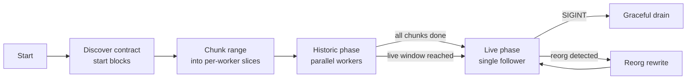
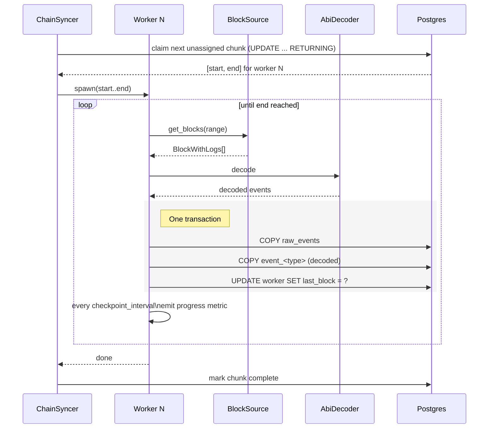

# Sync engine

The sync engine owns the "from block N to tip, and then follow forever" loop. It's a two-phase design — parallel historic backfill that hands off to a single live follower — coordinated through checkpoints in the `sync_schema`.

## High-level lifecycle

The transition from historic to live is automatic: when workers are within `max_reorg_depth + finality` of tip, the parallel mode is abandoned and a single worker follows the head.

## Workers and checkpoints

Each historic chunk (`sync.blocks_per_worker`, default 250,000 blocks) is owned by a worker row in the `sync_schema`. Workers are idempotent: killed mid-chunk, they resume from the last `checkpoint_interval` boundary.

### Why `COPY`

`COPY` is ~10-20x faster than batched `INSERT` at the row counts an indexer generates. Every write path — `raw_events`, decoded tables, traces, account events — goes through a `COPY` transaction. The time spent is exposed as the `kyomei_db_copy_duration_seconds` histogram.

## Retry behaviour

Failures inside a worker go through [src/sync/retry.rs](../src/sync/retry.rs):

- Transient (network, 5xx, timeouts) → exponential backoff, retry.
- "Range too big" / payload size → call `AdaptiveRange::shrink()`, retry with the smaller range.
- Logs-bloom mismatch → retry up to `retry.bloom_validation_retries` times.
- Permanent (deserialization, bad config) → fail the worker, surface via `kyomei_consecutive_errors` gauge.

### Silent-stall guard

`sync.max_live_consecutive_errors` (default 100) aborts the whole process after N consecutive live-phase failures. The intent is to prevent the classic failure mode where the process stays "up" by health-check standards but makes no progress.

## Parallel historic vs. single live

| Phase | Workers | Block source calls | Reorgs? |
|---|---|---|---|
| Historic | `sync.parallel_workers` (max 32) | Big ranges (`blocks_per_request`), many in flight (semaphore-capped). | Not considered — far enough from tip. |
| Live | 1 | One block at a time (or small ranges), paced by chain tip. | Detected and rewritten; see [reorg-handling.md](./reorg-handling.md). |

`parallel_workers: 1` mode makes the whole lifecycle sequential — useful for strict-ordering requirements or when you want rindexer-compatible behaviour.

## Within-worker address batching

When a worker's contract list exceeds `addresses_per_batch` (default 500), it splits addresses into parallel batches within the same worker. This keeps historic backfill fast when there are thousands of factory-discovered children without creating a new worker per child.

## Relevant source

- Orchestrator: [src/sync/chain_syncer.rs](../src/sync/chain_syncer.rs)
- Per-chunk worker: [src/sync/worker.rs](../src/sync/worker.rs)
- Progress/checkpoint: [src/sync/progress.rs](../src/sync/progress.rs), [src/db/workers.rs](../src/db/workers.rs)
- Retry policy: [src/sync/retry.rs](../src/sync/retry.rs)
- Trace/account/view sub-workers: [src/sync/trace_syncer.rs](../src/sync/trace_syncer.rs), [src/sync/account_syncer.rs](../src/sync/account_syncer.rs), [src/sync/view_indexer.rs](../src/sync/view_indexer.rs)
