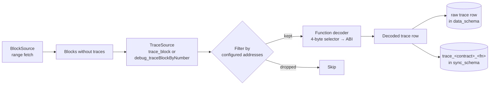

# Call traces

Traces capture function calls made *inside* a transaction — including nested calls from one contract to another, `CALL` / `DELEGATECALL` / `STATICCALL`, and internal ETH transfers. They're how you answer "what exactly happened in this tx" when event logs aren't enough.

Trace indexing is off by default because it's expensive: it requires a trace-capable RPC method and generates order-of-magnitude more rows than event indexing.

## Config

```yaml
traces:
  enabled: true
  method: "debug"              # debug | parity
  tracer: "callTracer"         # only for method=debug
  contracts:
    - name: "UniswapV2Router"
      address: "0x7a250d5630B4cF539739dF2C5dAcb4c659F2488D"
      abi_path: "./abis/UniswapV2Router.json"
      start_block: 10000835
    - name: "UniswapV2Pair"
      factory_ref: "UniswapV2Pair"   # reuse top-level factory-discovered addresses
```

## Methods

| `method` | RPC call | Supported by |
|---|---|---|
| `debug` | `debug_traceBlockByNumber` with a tracer config | geth, reth, erigon, nethermind (in debug mode) |
| `parity` | `trace_block` | parity, erigon (trace_* namespace) |

If your provider doesn't expose trace methods, set `fallback_rpc` on the source to a provider that does — only trace calls go to the fallback.

## Flow



Trace rows include:

- `block_number`, `tx_hash`, `trace_address` (call-tree position as JSON array, e.g. `[0,1,2]`)
- `from`, `to`, `value` (internal ETH transfer)
- `gas`, `gas_used`
- `call_type` (`call`, `delegatecall`, `staticcall`, `create`)
- `input`, `output` (raw calldata / return)
- `p_in_*`, `p_out_*` columns from ABI decoding (see [abi-decoding.md](./abi-decoding.md))
- `error` (non-null on revert)

## Interplay with accounts

Internal ETH transfers (`transfer:from` / `transfer:to` in [accounts.md](./accounts.md)) are extracted from trace rows — so if you use those account events, traces must also be enabled.

## Cost awareness

- `debug_traceBlockByNumber` is typically 10-50x slower and more expensive per block than `eth_getLogs`. Budget RPC accordingly or use a self-hosted archive node.
- Decoded trace tables can dwarf event tables in size. The `filter by configured addresses` step in the flow above is what keeps this bounded — only traces `to` / `from` a configured address are written.

## Metrics

- `kyomei_traces_indexed_total{chain_id, phase=historic|live}` — count of trace rows written.
- Trace RPC latency shares the `kyomei_rpc_latency_seconds` histogram.

## Relevant source

- Trace fetch: [src/sources/traces.rs](../src/sources/traces.rs)
- Trace sync: [src/sync/trace_syncer.rs](../src/sync/trace_syncer.rs)
- Function decoder: [src/abi/function_decoder.rs](../src/abi/function_decoder.rs)
- DB writer: [src/db/traces.rs](../src/db/traces.rs)
