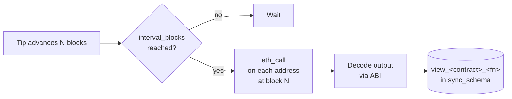

# View function indexing

Some data you want isn't in events — it's behind a view function: `totalSupply()`, `balanceOf(address)`, `getReserves()`. The view indexer calls these read functions on a schedule and stores each result as a time-series row.

## Config

```yaml
contracts:
  - name: "UniswapV2Pair"
    abi_path: "./abis/UniswapV2Pair.json"
    views:
      - function: "totalSupply"
        interval_blocks: 100
      - function: "getReserves"
        interval_blocks: 50
      - function: "balanceOf"
        interval_blocks: 1000
        params: ["0xdead000000000000000000000000000000000000"]
```

- `interval_blocks` — how often to call (a block-based cron).
- `params` — constant arguments (hex-encoded for addresses, decimal for numbers).

## Flow



## Table shape

```sql
CREATE TABLE view_uniswap_v2_pair_total_supply (
    id           BIGSERIAL PRIMARY KEY,
    block_number BIGINT NOT NULL,
    block_hash   TEXT   NOT NULL,
    timestamp    BIGINT NOT NULL,
    address      TEXT   NOT NULL,
    -- one column per output parameter:
    o_value      TEXT   NOT NULL
);
```

For functions returning tuples (e.g. `getReserves` → `(uint112, uint112, uint32)`), each slot gets its own `o_<name_or_index>` column.

## Scale

When a view is attached to a factory-discovered contract like `UniswapV2Pair`, the view call fans out to *every* discovered child every `interval_blocks` blocks. This can be thousands of `eth_call`s. Controls:

- Raise `interval_blocks` to reduce call frequency.
- Set `params` to narrow to the addresses you actually care about rather than "all children".
- The view indexer shares the same RPC semaphore as the sync engine, so it can't starve block ingestion.

## Relevant source

- View indexer: [src/sync/view_indexer.rs](../src/sync/view_indexer.rs)
- ABI output decoding: [src/abi/function_decoder.rs](../src/abi/function_decoder.rs)
